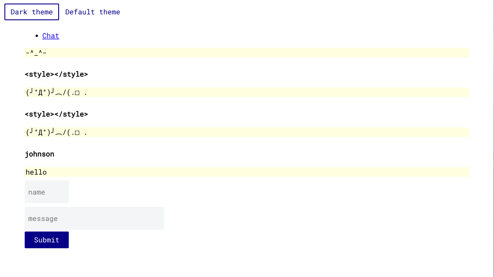

# Simple Chat App with Prisma



## Tech Stack

### Backend (/prisma /src)

- PostgresSQL
- Node.js
- Prisma V2
- GraphQLServer from graph-yoga
- Typescript
- GraphQL

### Frontend (/cra)

- Create-React-App
- Styled-Component
- Apollo / Graphql
- Typescript
- React

## How to run

```sh
# Install Prisma
npm i -g @prisma/cli
# Install backend
yarn
# Install frontend
(cd cra && yarn)
# Setup env
mv prisma/.env.copy prisma/.env
# Setup PostgresDB
psql
# Create table
> CREATE DATABASE prismagql;
> \q
# Prisma DB Migrate
npx prisma migrate up --experimental
# Run backend
npm run dev
# Run frontend
(cd cra && npm start)
```
